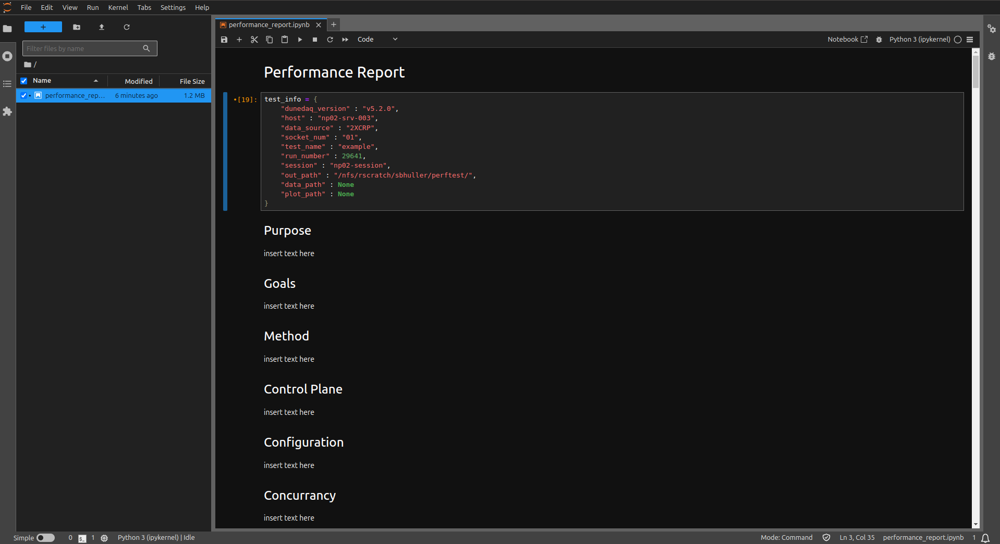
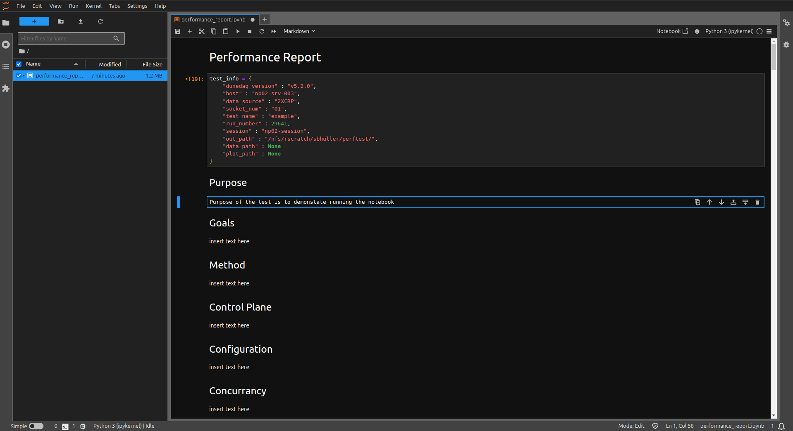
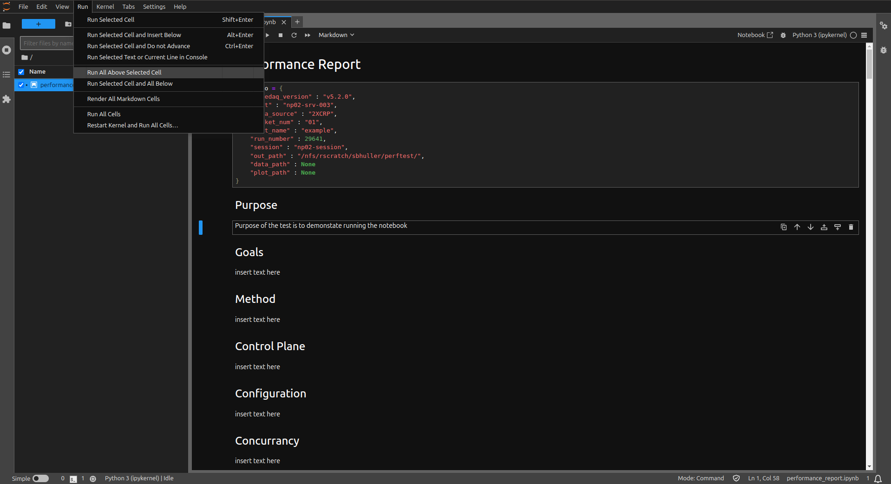
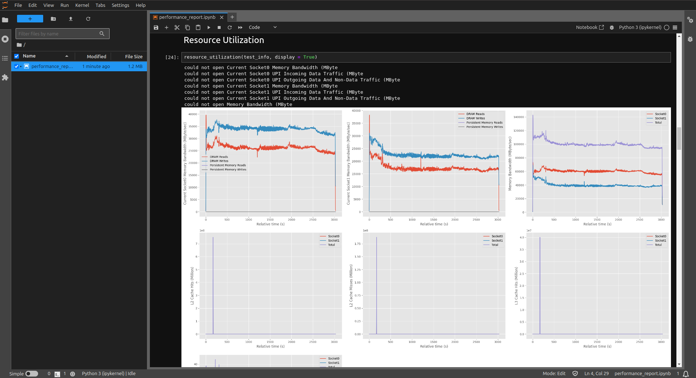

# Micro Service

**Note that this should only be run on np0x machines which are seldom used, for example np04-srv-017.**

The shared work area is setup on `/nfs/sw/dunedaq_performance_test/`. To setup, simply run
```[bash]
source env.sh
```

all work should be done in the `work` directory which any user can read/write from.

In this environment, the above instructions can be run to produce performance reports, but in addition, a jupyter notebook has been setup for a more interactive experience.

To start the notebook session run the following command

```[bash]
jupyter lab $PERFORMANCE_TEST_PATH/app/ --no-browser --port=8080
```

and note that if the port is being used then another 4 digit number should be used in place of `8080`. You should see a url which looks like
```[bash]
http://localhost:8080/tree?token=...
```

Now, on your local machine tunnel to the server running the service:

```[bash]
ssh -L 8080:localhost:8080 <user-name>@<server-name>
```

Then, in your browser open the above url and you should be able to see the jupyter file explorer and you can open `performance_report.ipynb`

The notebook should look something like this:



The first cell shows infmormation in the json file, so fill these out as appropriate. The cells below are markdown text with a heading corresponding to each one in the performance report. in the cells called `insert text here` you can add your comments and notes to the performance report.



Note that is the text is not modified or is left blank, the boilerplate text is added to the notebook instead. Once all the comments are made and the test info is supplied, save the notebook (Ctrl-S) and then on the tab click Run -> Run All Cells.



Once complete, you should be able to see plots of the metrics for the given run:_description_



and the final cell should also create the pdf version of the performance report written to `out_path`.

### extra information

 - When using either the notebook or `generate_performance_report.py`, you can manually supply the `data_path` and the `plot_path` if you want to skip the metrics collection or plotting steps.
 - For the urls to work, you need to upload the files to the public cernbox (url provided), this sohuld be done periodically anyway if your performance reports are written to `/nfs/rscratch/sbhuller/perftest`
